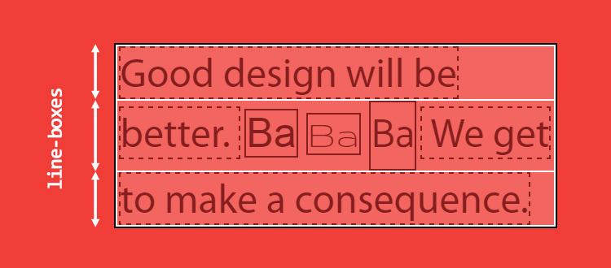
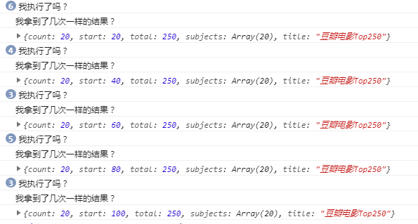

# douban-movie

## ★plan

> 以JavaScript为划分，目的只是想换个姿势写写，仅此而已……

- [ ] jQuery版
- [ ] 模块化版
- [ ] 原生JavaScript版
- [ ] Vue版
- [ ] React版

## ★资料

**➹：**[nanyang24/douban-movie: ☘移动端-豆瓣电影推荐入口 / A doubanAPI movies entrance](https://github.com/nanyang24/douban-movie)

**➹：**[豆瓣电影](http://book.jirengu.com/jirengu-inc/js-works/projects/doubanmovie/index.html)

## ★效果

扫描二维码，于手机上查看效果：


## ★涉及技术

### ◇jQuery版

1. HTML5、CSS3、JavaScript
2. jQuery
3. MVC思想
4. 懒加载

## ★简述

这是一个简单的单页应用，通过豆瓣提供的豆瓣电影API，让我做出了以下简单但实用的功能：

1. 展示豆瓣评分top250的电影
2. 展示目前北美电影排行榜
3. 展示目前正在电影院热映的电影（默认是北京那边的电影院）
4. 电影搜索

## ★完善

- [x] 每次搜索能不能清空上次搜索的结果？（判断填充内容的容器是否有子节点，有那就清空，然后再发请求……）
- [x] 如果搜索没有找到结果呢？那么该提示什么内容给用户看呢？
- [ ] 当我们点击一个链接，跳转到其它页面，然后回退的结果并不是我们原先跳的位置，那么如何记录原先跳的位置呢？——前端路由（不过这在移动端浏览的话，按下返回键还是可以回到原先位置的）
- [x] 添加个「[正在热映](https://web.archive.org/web/20151004012429/http://developers.douban.com/wiki/?title=movie_v2#in_theaters)」的tab，它是个商务接口，不知为啥，关于对数据请求是可以用的，而高级接口则不可以

## ★bug

- [x] 关于http和https请求混合的问题（注意图片的请求，ajax请求，以及第三方库资源的请求，它们都最好用的是  `//`）
- [x] 重新输入搜索，回导致start请求参数，会接着上一次请求的start参数来（清空元素后，顺便把start归零）
- [ ] 在QQ浏览器上浏览，那个底部tab有样式bug……而在UC浏览上测试也有样式bug——最后一个电影item显示不全（在夸克浏览器上浏览，体验最好）
- [ ] 有些电影条目的数据是没有的，如导演什么的……所以是不是要给一个默认值什么的

## ★总结

- 关于对事件添加回调，这个回调还是不要用箭头函数……因为我们一般都是要被点击的那个元素……如果你想要那个容纳属性的那个对象，那就定义一个 `_this`就好了……
- 我们可以在init函数里边，为对象隐式的添加属性，而这些属性一般都是目标元素的DOM对象、状态判断、请求参数等……

## ★Q&A

### ①移动端调试？

使用了browser-sync这个工具，在使用这个工具的过程中遇到一个bug，就是手机的预览地址有问题，于是我就这样做了：


难道是在windows下的bug？或者说是为啥得到的是一个 `172.10.……`的ip？而不是 `192.168.……`？当然，这个172的在pc端也是能访问的，只是我的手机无法访问……

接着我就打算调试移动端的log，然而Browsersync UI界面没有Remote Debugger(weinre)的开关，就像这样：


为此，我看了这个issue：<https://github.com/BrowserSync/browser-sync/issues/1413>

说是已经弃用什么的……因为weinre已经过时了，那么既然如此，那我该用啥？难道安装旧版本吗？

就像这样：

```bash
 npm i -g browser-sync@2.0.0
```

回顾我的需求「我只想看看移动端的Console，也就是移动端的调试」

所以有了这样的问题：

**➹：**[怎么在移动端调试web前端? - 知乎](https://www.zhihu.com/question/24250869)

就这样，找到了一个开源的调试工具——[Eruda](https://github.com/liriliri/eruda/blob/master/doc/README_CN.md)（一个专为手机网页前端设计的调试面板）

它的简单使用：

1. 对当前项目`npm init`一下，然后一直回车即可

2. 局部安装这个工具： `npm install eruda --save`，不过我觉得这个应该是开发时依赖吧！

3. 在页面中加载脚本：

   ```html
   <script src="node_modules/eruda/eruda.min.js"></script>
   <script>eruda.init();</script>
   ```

还有一个调试工具：

**➹：**[wuchangming/spy-debugger: 微信调试，各种WebView样式调试、手机浏览器的页面真机调试。便捷的远程调试手机页面、抓包工具，支持：HTTP/HTTPS，无需USB连接设备。](https://github.com/wuchangming/spy-debugger)

### ②回顾页面书写套路

1. 先css reset
2. 通用样式，比如 .layout, .clearfix等
3. 通用组件，如 .btn, .footer等
4. 页面样式
   - body设置默认字体大小、字体、行高、字体颜色、背景色等
5. 先分大块，再分小块，再细节
6. 使用语义化标签，class能省则省
7. 书写html时忽略除内容外的一些附属细节，完善附属细节时尽量考虑用伪元素代替，标签能省则省

### ③vw、vh、calc()、百分比？

在了解它们表示什么意思之前，先来看看viewport的意思：


> 注意：这个模拟的Console也是属于视口的一部分……当然它是绝对定位，脱离文档流的！

所以说，viewport就是视口、浏览器窗口的可视区域的意思，注意这包括滚动条的宽度，而且我们可以通过以下代码获取视口大小：

```js
window.innerWidth
window.innerHeight
```

了解了这个概念，vw和vh就很好理解了

1. vw Viewport宽度：1vw 等于viewport宽度的1%
2.  vh Viewport高度：1vh 等于viewport高的的1%

 可见，它们俩是会随着视口大小的变化而变化的，如视口的宽此时是500px，那么如果有用到10vw为宽度的盒子，那么盒子的实际宽度就是50px啦！如果视口的宽缩水了一半，即250px的话，那么该盒子也会缩水一半，即25px！

总之你就这样看1vw就好了：

```
//假设此时的视口宽度为500px，那么：
1vw = 1*500px*1% = 5px
//你也可以认为1vw就是1%vw，10vw就是10%vw,100vw就是100%vw，即500px
```

关于`calc()`，calculate(计算)的缩写，可以理解为一个函数，是css3的一个新增的功能，用来指定元素的长度。如：可以使用calc()给元素的border、margin、pading、font-size和width等属性设置动态值。总之`calc()` 能让你给元素的做计算，当然这计算任务是浏览器来做的，而不是你去计算……

那么它的语法是怎样的呢？

```
使用“+”、“-”、“*” 和 “/”四则运算；
可以使用百分比、px、em、rem等单位；
可以混合使用各种单位进行计算；
表达式中有“+”和“-”时，其前后必须要有空格，如"widht: calc(12%+5em)"这种没有空格的写法是错误的；
表达式中有“*”和“/”时，其前后可以没有空格，但建议留有空格。
```

例子：设置div元素的高度为当前窗口高度-100px

```css
div{
	height: calc(100vh - 100px);     
}
```

关于百分比单位：

我们知道有些单位是相对父级的，又或者是自身的，又或者是视口的等等

那么关于`height:100%`是相对于谁呢？——相对于父级高度！

如果我对html元素搞了这样一条声明：

```css
html {
  height: 100%;
}
```

那么它的父元素是谁呢？也就是说html的高度为100%的作用是什么？

就是为了让body的高度100%有参考高度，不然div的百分比高度也会无效。可即便如此还是无法真正解释这样做的缘由。

既然如此，那就先来看看宽度：

宽度是默认就有的，即我们不设置宽，浏览器会自动将页面内容平铺填满整个横向宽度。所以我们不需要显示声明宽度。

有了对宽度的认识，我们再来看看高度：

> 事实上，浏览器根本就不计算内容的高度，除非内容超出了视窗范围(导致滚动条出现)。或者你给整个页面设置一个绝对高度。否则，浏览器就会简单的让内容往下堆砌，页面的高度根本就无需考虑。因为页面并没有缺省的高度值，所以，当你让一个元素的高度设定为百分比高度时，无法根据获取父元素的高度，也就无法计算自己的高度。
>
> 即父元素的高度只是一个缺省值：height: auto;我们设置height：100%时，是要求浏览器根据这样一个缺省值来计算百分比高度时，只能得到undefined的结果。也就是一个null值，浏览器不会对这个值有任何的反应。

注意：各个浏览器对于宽高的解析也不相同，大家可以自己搜索一下。如 <http://www.webhek.com/post/css-100-percent-height.html>

总之当你对html这个根元素添加 `height:100%`的时候，你通过控制台审查元素会发现，它会撑满这个视口高度区域！至于你之前所说的根元素之上，显然是没有东西了，因为它是根元素啊，不然难道还有土元素？


> 滚动条的宽度可不是html元素的一部分
>
> 还有计算出来视口大小很有意思：
>
> 
>
> 还有一个问题就是图中出现垂直滚动条的问题，如果咩有对body元素添加 `height:100%;`的话，那么是不会出现滚动条的，而如果添加上了的话，是会出现的，所以这是什么原因呢？
>
> 因为chrome的body元素有默认的 `margin:8px;`啊！当你设置为0的时候，就没有滚动条了！基于盒子是默认的 `box-sizing: content-box;`，所以当你body有margin的时候，显然body元素撑高了16px，而固定的视口高度只有247px，所以溢出的16px就导致滚动条的出现了！
>
> 总之body元素这个盒子的默认高度为16px+270px=286px
>
> 有一点需要注意的是，我即便弄成是`box-sizing: border-box;`，这个滚动条还是会存在的，我原以为会让这个body元素的内容高度内缩16px，不过我想了想，好像是padding才会让这个盒子内容缩小呀，而margin是不会的：
>
> 

还有一个细节就是：

<https://jsbin.com/rekabumeze/edit?html,css,output>

```html
<style> 
.fa {
  width: 500px;
  height: 100px;
  border: 2px solid red;
}

.son {
  border: 2px solid green;
  width: 10%;
  height: 10%;
  padding-top: 10%;
}
</style>
<body>
 <div class="fa">
   <div class="son"></div>
 </div>
</body>
```

padding-top相对的是父元素的宽，而不是高……也就是说：

相对于父级宽度的：

> `max-width`、`min-width`、`width`、`left`、`right`、`text-indent`、`padding`、`margin`、`grid-template-columns`、`grid-auto-columns`、`column-gap` 等；

相对于父级高度的：

> `max-height`、`min-height`、`height`、`top`、`bottom`、`grid-template-rows`、`grid-auto-rows`、`row-gap` 等；

相对于自身字号的：

> `line-height` 等；

相对于行高的：

> `vertical-align` 等；

**➹：**[什么是viewport，为啥需要viewport - 移动开发](http://www.myexception.cn/mobile/428756.html)

**➹：**[JS获取浏览器可视区域尺寸-大前端](http://www.daqianduan.com/3784.html)

**➹：**[使用calc()设置内容高度 - 简书](https://www.jianshu.com/p/56051210c9e4)

**➹：**[CSS3的calc()使用_calc, css3属性详解 教程_w3cplus](https://www.w3cplus.com/css3/how-to-use-css3-calc-function.html)

**➹：**[CSS五种方式实现Footer置底 - 每天学点前端开发 - SegmentFault 思否](https://segmentfault.com/a/1190000008516654)

**➹：**[★css样式的百分比都相对于谁？ - 知乎](https://www.zhihu.com/question/36079531)

**➹：**[html,body高度100%的作用-云栖社区-阿里云](https://yq.aliyun.com/articles/559106)

**➹：**[详述css中的百分比值 - 庭院茶 - SegmentFault 思否](https://segmentfault.com/a/1190000000590998)

**➹：**[前端小知识--为什么你写的height:100%不起作用？ - 知其所以然——前端 - SegmentFault 思否](https://segmentfault.com/a/1190000012707337)

**➹：**[javascript - 各浏览器滚动条默认宽度是多少？ - SegmentFault 思否](https://segmentfault.com/q/1010000004817695)

### ④单行文本的字体大小是否是这个盒子的内容高度？

代码： <https://jsbin.com/xeyexay/edit?html,js,output>

```html
<head>
    <style>
        div {
            width: 100%;
            height: 100%;
            background-color: blueviolet;
            text-align: center;
        }
    </style>
</head>
<body>
    <div>
    	width:100%;height:100%
    </div>
</body>
```

效果：


我通过审查元素得知，该盒子的内容高度为21px，而文字的默认大小为16px，而且当我们更换了不同的字体，这个21px还是会变的！

当然，当你对这个盒子设置了行高的话，那么行高的值就是该盒子的最终高度了！

既然如此，那么在没有设置行高之前为啥是21px呢？

因为一款字体会定义一个em-square——用来盛放字符的金属容器。而且这个 em-square 一般被设定为宽高均为 1000 相对单位，不过也可以是 1024、2048 相对单位。

一个字符有一些很重要参考参数：


如ascender「字母的上半（或下半）出头部分」和descender「下行字母」

有这么一款字体：Catamaran


> 注意：不同的系统操作平台（如macOS、Windows……），这些参数可能也会有所不同！

该字体占据了 1100 + 540 个相对单位，尽管它的 em-square 只有 1000 个相对单位，所以当我们设置 font-size:100px 时，这个字体里的文字高度是 164px。而**这个计算出来的高度决定了 HTML 元素的 content-area（内容区域）**，关于 content-area ，你可以认为是 background 作用的区域

注意：这是决定，而不是等于，因为浏览器需要通过它们来计算line-box的值！

> 可见px是个相对单位，而不是绝对单位！
>
> 但是当我看了一些回答：
>
> **➹：**[【CSS】px是相对单位还是绝对单位？ - 知乎](https://www.zhihu.com/question/67571440)
>
> 都说是绝对单位
>
> 而这个答案：
>
> **➹：**[【CSS】绝对单位和相对单位 - 简书](https://www.jianshu.com/p/80c960ba888b)
>
> 说是相对单位哈！
>
> 所以你应该去mdn，mdn说什么就是什么：
>
> **➹：**[<length> - CSS：层叠样式表 - MDN](https://developer.mozilla.org/zh-CN/docs/Web/CSS/length#px)
>
> px：与显示设备相关。对于屏幕显示，通常是一个设备像素（点）的显示。
> 对于打印机和高分辨率的屏幕，一个CSS像素意味着多个设备像素，因此，每英寸的像素的数量保持在96左右。
>
> 讲真，没看懂……TMD，你这个单位与显示设备相关，难道还不是相对单位吗？
>
> 题外话：用一个4k屏幕去看网页，网页的字显得特别小

其它的一些结论：

**①em 是基于 font-size（100px），而不是基于计算出来的高度（164px）**


**②line-box 的高度是由它所有子元素的高度计算得出的**。

浏览器会计算这一行里每个子元素的高度，再得出 line-box 的高度（具体来说就是从子元素的最高点到最低点的高度），所以默认情况下，一个 line-box 总是有足够的高度来容纳它的子元素。所以说：**每个 HTML 元素实际上都是一堆 line-box 的容器，如果你知道每个 line-box 的高度，那么你就知道了整个元素的高度。**


> 还有存在多个匿名行内元素

有这样一份代码：

```html
<p>
    Good design will be better.
    <span class="a">Ba</span>
    <span class="b">Ba</span>
    <span class="c">Ba</span>
    We get to make a consequence.
</p>
```

显示效果：



解释一波：

1. 黑色实线边框是p元素，白色实线边框是line-boxes的，黑色虚线边框是行内元素和所谓的匿名行内元素的！

2. 我们得到了3个宽度固定的line-box，其中第一行和最后一行各有一个匿名内联元素（文本内容），而中间一行则包含两个匿名内联元素和三个 span。

3. 我们清楚地看到第二个 line-box 比其他两个要高一些。因为第二行里面的子元素因为有一个用到了 Catamaran 字体的 span。显然它的内容区域（164px）要比其它相邻的行内元素要高！

4. 如果我们能看到line-box的高度，显然我们就知道这p元素的高度到底是多少了，然而line-box 的难点在于我们看不见它，而且不能用 CSS 控制它。即使我们用 ::first-line 给第一行加上背景色，我们也看不出第一个 line-box 的高度，即那个一行一行的白色边框。

   或许你会疑问，现在那个图不是看得出line-box的高度吗？——看的出个鬼，这里的字体大小都设置为了100px，其中第二行存在4种字体，其中一种是默认字体，而另外3种字体的字体高度分别是：

   

   所以即便你是默认字体无法得知这些个匿名行内元素是不是100px的高度，因此一个行盒的高度，你是无法确定的，毕竟你无法知道那个164px才是最终答案呀！

   所以「单行文本的字体大小是否是这个盒子的内容高度？」这个问题答案是：

   显然不是，因为这得取决于行盒啊！而行盒高度又会根据匿名行内元素或行内元素来确定，而匿名元素或行内元素的高度则是根据字体的种类来确定的。因此font-size显然只是决定一个匿名行内元素或行内元素的高度的因素之一，毕竟还有一个字体种类啊！

其它的一些结论：

关于line-height：

1. line-box 的高度是根据子元素的高度计算出来的，而不是子元素的 content-area 的高度

2. 一个内联元素有两个高度：content-area 高度和 virtual-area （实际区域？）高度

3. content-area 的高度是由字体度量定义的；vitual-area 的高度就是 line-height，这个高度用于计算 line-box 的高度

   

4. 一个长久的谣言：「line-height 表示两个 baseline 之间的距离」。然而在 CSS 里，不是这样的。virtual-area 和 content-area 高度的差异叫做 leading。leading 的一半会被加到 content-area 顶部，另一半会被加到底部。因此 content-area 总是处于 virtual-area 的中间。

**➹：**[深入理解 CSS：字体度量、line-height 和 vertical-align - 知乎](https://zhuanlan.zhihu.com/p/25808995)

**➹：**[张鑫旭_慕课网精英讲师](https://www.imooc.com/t/197450)

### ⑤豆瓣电影API问题？

在本地渲染数据的时候，图片请求是403，而当我上传到github上时，图片请求是200……

### ⑥jQuery对象和DOM对象相互转化？

得到DOM对象：

```js
var btn = document.getElementById(“btnShow”); // btn就是一个DOM对象
```

得到jQuery对象：

```
var $btn = $(“#btnShow”); // $btn就是一个jQuery对象
```

jQuery对象转换为DOM对象：

```
var btn1 = $btn[0]; //推荐这种姿势 
var btn2 = $btn.get(0);
```

测试效果：


**➹：**[jquery对象和DOM对象的相互转换 - 简书](https://www.jianshu.com/p/af308135e5b2)

### ⑦为main这个元素绑定scroll事件无法触发？

> 在document视图或者一个element在滚动的时候，会触发元素的`scroll`事件。

适用对象：

1. window对象
2. 可滚动的frames
3. CSS overflow属性设置为scroll的元素（或auto时，元素的显示高度小于其内容高度）

测试代码：

<https://jsbin.com/morimuj/1/edit?html,css,js,console,output>

猜测：

> 很有可能是CSS的缘故（其实不是……）

1. 难道是因为滚动了body的滚动条？
2. 难道是……？

结果：

我也不知道为啥突然就可以了……或许是控制台关于图片请求bug的信息掩盖了log、在判断条件里边， 把`$('main').height()`写成了 `$('main').height`   ，导致滚动到底的时候没有加载数据，更加地误以为scroll事件没有触发了……

总之解决这个问题关键点是：在移动端调试发现有log（总不能移动端可以触发滚动事件，而PC端不能吧！）

### ⑧用Loading动画体现CRM？

> 需求：第一次进入页面的loading是绝对居中，之后的懒加载动画和这个是不一样的

先测试一下动画能否进行（可以用codepen等在线编辑器），然后就扔到项目里边去！

**➹：**[Loading](https://codepen.io/dicson/pen/vOxZjM)

### ⑨函数去抖（防抖）和函数节流？

**函数去抖：** 像是做菜时放盐一样，如我左手拿个木铲，右手拿包盐，盐不够就抖点盐下来，如果你抖一点，就扔到锅里边的话，显然你需要不停地把木铲举起来，然后倒一点盐又举下去，即不停地抖盐和放盐，这样如此反复的话，显然太费劲了，于是干脆就把木铲一直举着，直到10s后才把盐一起扔到锅里去，如果在10s之内，需要抖盐的话，又得重新等10s后才把盐倒下去，总之放盐到锅里的这个操作需要等10s后才能做，而且期间如果出现抖盐的话，又得重新计时……

用代码来表示的话：

```js
var timerId = null
木铲.是否需要抖盐 = function() {
    if(timerId) {
        window.clearTimeout(timerId)
    }
    timerId = setTimeout(()=>{
        把盐扔到锅里去()
        timerId = null
    },10000)
}
```

一句话概括就是「带着一起做或者说是我为锅带盐」

**函数节流：** 像是玩LOL时，技能冷却CD一样，如一般英雄大招技能，即R键，都会冷却一大段时间，因此你在这段时间之内是无法释放技能的，直到冷却结束……

用代码来描述就是：

```js
var cd = false
玩家.是否看到敌方英雄 = function() {
    if(cd) {
    	提示信息('蒙多骂你是个大娘们')
    } else {
        //直接一个大宝剑，然而不怎么掉血哈……
        甩手一个大宝剑()
        cd = true
        var timerId = setTimeout(()=>{
            cd = false
        },假设德玛一级大招90秒)
    }
}
```

两个字概括就是「CD」

所以我们这个项目的scroll事件，然后里边的发请求类似于把盐扔到锅里去：

```js
var clock = null
$('main').scroll(function () {
    if (clock) {
    	clearTimeout(clock)
    }
    clock = setTimeout(function () {
    if ($('section').eq(0).height() - 10 <= $('main').scrollTop() + $('main').height()) {
        console.log('我执行了吗？')
        start()
        clock = null
    }
    }, 300)
})
```

从代码形式上，这似乎就是函数去抖，即距离底部的10px之内，如果300ms之内用户没有再次滚动的话，那就去触发start函数……

测试结果：


可见距离底部10px之内触发了2次，照理说同样会有两次log「我拿到了几次一样的结果？」当由于我们在前面对start函数加锁了，所以在数据还没有来到或者说是还没有把数据渲染到页面的时候，第二次start是直接return掉的！

当你把时间调到几秒左右的时候，最后10px之内大概只触发1次start了，当然这样测试的效果不是很好，你可以直接弄成是0，这样你会发现结果是这种情况了：



总之你就把这个时间弄成是100ms~300ms的……反正我们还有个锁不是……如果弄得时间过久的话，那么发请求的时间也会久……

所以当我们设置了定时时间之后，如大概300ms这样的时间间隔，大概就会执行两次setTimeout里回调里的start函数……不然，如设置为0ms这样的间隔就会执行多次start函数

> 设置300ms的时间间隔性价比最高！

所以这就是函数去抖的例子啦！即函数去抖让我们执行setTimeout的回调，相较于没有去抖前减少了很多次

我在想，这函数节流应该也可以做到吧？

那么问题来了，函数节流和函数去抖它们俩的功效是不是大致一样的？——一个强调定时器的返回值，一个则是CD的状态判断！

> 1. 函数节流和函数防抖是我们解决频繁触发DOM事件的两种常用解决方案，都对提升页面性能有显著的功效。
> 2. 函数节流和函数防抖都是通过减少实际逻辑处理过程的执行来提高事件处理函数运行性能的手段，并没有实质上减少事件的触发次数。

**➹：**[JS - 函数节流和函数防抖 - 简书](https://www.jianshu.com/p/4b96922972e5)

**➹：**[轻松理解JS函数节流和函数防抖 - 掘金](https://juejin.im/post/5a35ed25f265da431d3cc1b1)

**➹：**[[JavaScript] 函数节流与去抖 · Issue #5 · hahnzhu/read-code-per-day](https://github.com/hahnzhu/read-code-per-day/issues/5)

### ⑩fadeIn()和fadeOut()？

这两个API的配合让我觉得点了一个tab之后，再次点的话会无效哈（其实还是触发了点击事件）……

**➹：**[深入学习jQuery的三种常见动画效果 - 小火柴的蓝色理想 - 博客园](https://www.cnblogs.com/xiaohuochai/p/5932616.html)

### ⑪如何查看一个元素能否绑定某些事件（如scroll）?

> 再次遇到scroll事件无法触发的bug！看来我得去看看高程3关于事件的那章……

原来是元素绑错了……

关于scroll事件的目标元素是谁或者说是谁产生了scroll事件（通过performance面板录制一下滚动动作，然后在event lop里查看scroll事件的目标元素即可）：


还有一个是查看一个元素所绑定的事件：


**➹：**[你所不知道的scroll事件：为什么scroll事件会失效？ - Ayase-252's wonderland](https://ayase.moe/2018/11/20/scroll-event/)

**➹：**[chrome怎样查看一个元素绑定的事件？ - m0_37158404的博客 - CSDN博客](https://blog.csdn.net/m0_37158404/article/details/83088800)

### ⑫键盘上有两个Enter?

你得这样判断  `e.key === 'Enter' || e.keyCode === 13`

**➹：**[HTML键盘Enter(回车)事件绑定-yellowcong - yelllowcong的专栏 - CSDN博客](https://blog.csdn.net/yelllowcong/article/details/77033048)


### ⑬判断一个元素有没有子节点？以及如何清空元素的子节点？

使用jQuery姿势：

看看这个jQuery化 的DOM对象的length是否大于0；使用empty()即可清空元素的子节点。

**➹：**[jquery 判断元素下是不是有子元素 - 彻底拆分，一切可控！ - CSDN博客](https://blog.csdn.net/tengdazhang770960436/article/details/39004719)

**➹：**[jQuery删除/清空指定元素下的所有子节点的方法 - 飞鸟慕鱼博客](https://www.feiniaomy.com/post/134.html)

### ⑭如何去掉图片的http/https?

> 部署到github上，然后测试这个网页是否能正常运行，结果出现https与httph混合的问题，导致某些图片无法加载，而我测试图片 `//……`，这样也能正常显示的……所以就得用正则去掉，但是我不会写呀


**➹：**[正则表达式去掉URL中的(http-https-ftp-rtsp-mms)-CSDN论坛](https://bbs.csdn.net/topics/90153811)

**➹：**[关于启用 HTTPS 的一些经验分享（三） - JerryQu 的小站](https://imququ.com/post/sth-about-switch-to-https-3.html)

### ⑮为啥图片总是无法显示？⑤问题显然是理解错了……

没有这个之前：

```html
<meta name="referrer" content="never">
```


有了它之后：


总之，有了它之后就可以隐藏来源页地址了

注意，千万不要弄成是 `nerver`值……还有就是你得留意图片的缓存问题，以及针对github项目预览时，有过添加cname，然后又删除，由于dns缓存，导致原先的预览地址失效的问题，所以你得清除dns缓存

地址：<chrome://net-internals/#dns>


**➹：**[provisional headers are shown 知多少 - 掘金](https://juejin.im/post/5c00980751882518805add83)

**➹：**[如何隐藏来源页地址？referer-policy 对比讲解](https://newsn.net/say/referer-policy.html)

### ⑯如何实现前端路由？

**➹：**[前端路由是什么东西？ - 知乎](https://www.zhihu.com/question/53064386)

**➹：**[SME-FE/sme-router: A lightweight router lib that implement with express route style](https://github.com/SME-FE/sme-router/tree/master)


⑰⑱⑲⑳


